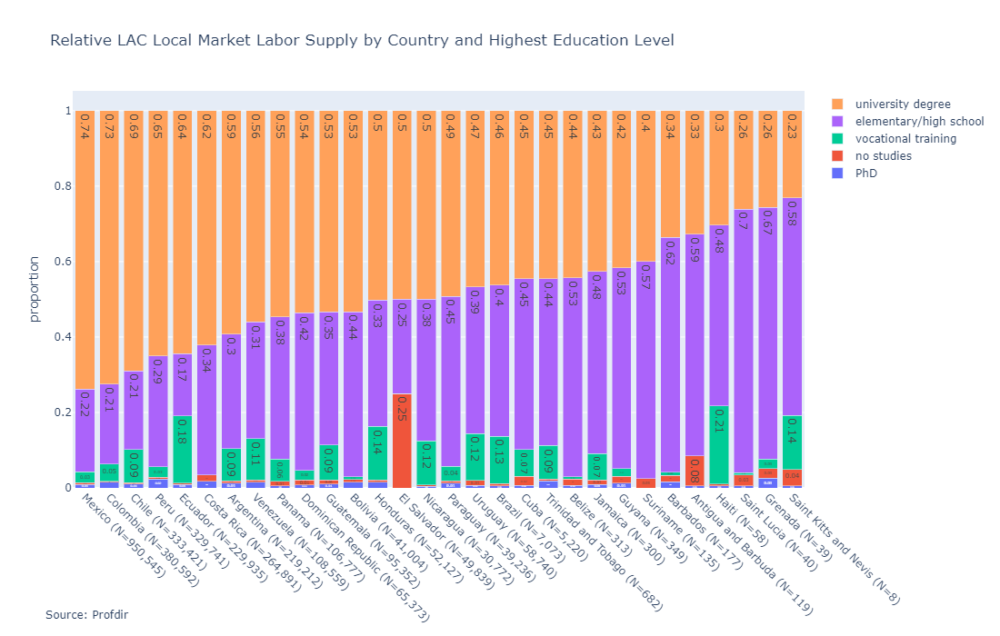
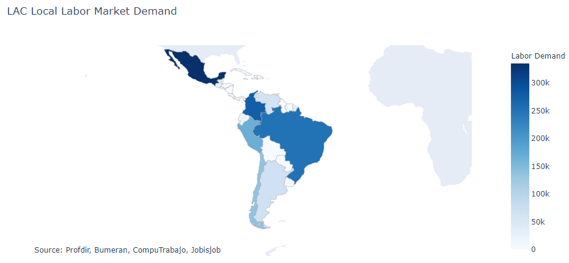
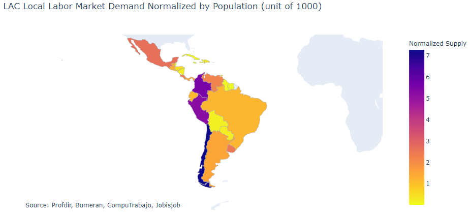

More than 1 million Chilean people protested in Santiago, the capital of Chile, to demand higher wages, more jobs, better living conditions, and removal of cabinet members. I am working as a data scientist at the UN to provide data solutions to present the labor market dynamics to the labor ministers of Latin America and Caribean countries and assisting economists in designing better labor policies for sustainable economic developments.

The United Nations and governments in LAC countries don't have time-series data for labor market dynamics, and the presidents and economic affairs officer want to learn more about the labor market while catching up with the big data transformation. To address the lack of data, I implement web scrapers to gather millions of job postings and talent profiles from 9 online job sites daily, weekly, or monthly based on the scale of demand. I collect the demanded skills, education level, experience, contract type, salary, and other labor-related data per city, per country, and per sector. Then, I work with economists to draw on a variety of complementary sources from the international, pan-regional, and national levels to analyze freelancing, full-time, and part-time markets. This is an ongoing research project, and I am motivated to use data science to facilitate regional evidence-based labor policy change with the United Nations.

<h3>Small parts of the visualizations:</h3>

	

		

			
		

		

						

	

